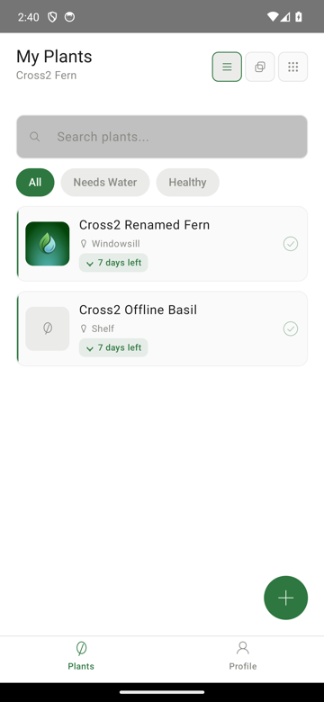
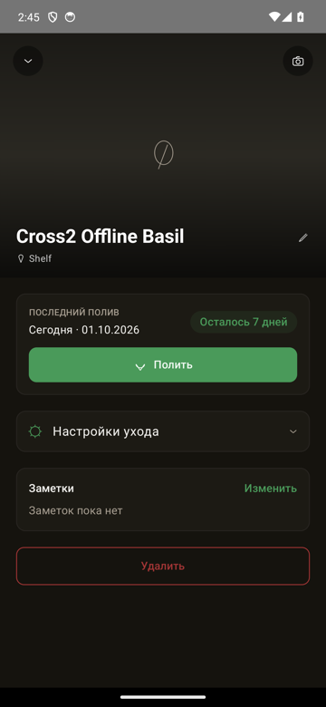
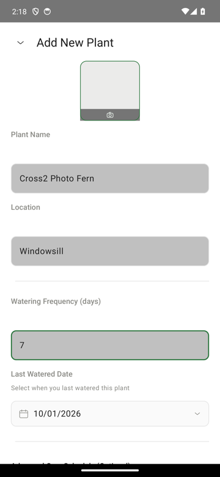
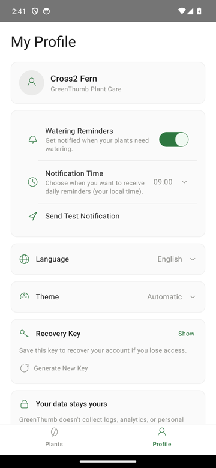
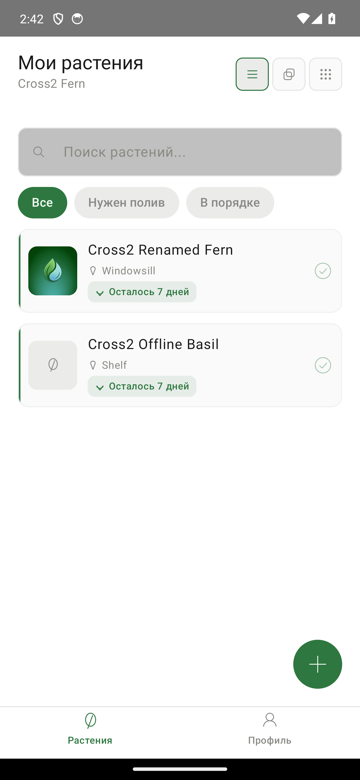
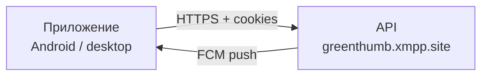

<div align="center">


# GreenThumb

**Уход за растениями: напоминания о поливе, фото, офлайн-работа.**

[](kmp/README.md)
[](kmp/README.md)
[](kmp/README.md)
[](https://github.com/vivogf/greenthumb-mobile/actions/workflows/check.yml)
[](kmp/docs/release-gate-rollout.md)

</div>

## Скриншоты

<table>
  <tr>
    <td align="center"><br><sub>Список растений</sub></td>
    <td align="center"><br><sub>Карточка растения</sub></td>
    <td align="center"><br><sub>Добавление растения</sub></td>
    <td align="center"><br><sub>Настройки</sub></td>
    <td align="center"><br><sub>Русский язык</sub></td>
  </tr>
</table>

## Возможности

- **Напоминания об уходе** — полив, удобрение, пересадка, обрезка: у каждого
  растения своя частота и «последний раз».
- **Фото растений** — снимок с камеры или из галереи, с ресайзом перед загрузкой.
- **Офлайн-работа** — приложение работает из локальной базы без сети; изменения
  ставятся в очередь и досылаются при подключении.
- **Push-напоминания** — в выбранный час, тап открывает карточку растения.
- **Русский и английский** языки, светлая и тёмная темы.
- **Анонимный вход по recovery key** — без почты и пароля; ключ создаётся на
  устройстве и хранится только у вас.
- **Удаление аккаунта прямо в приложении** — с полной локальной чисткой.

## Как устроено

- **Kotlin Multiplatform** — общий код (сеть, хранилище, бизнес-логика, UI на
  Compose Multiplatform) в `kmp/shared`.
- **Android** — релизное приложение (`kmp/androidApp`, пакет
  `com.greenthumbplantcare`).
- **JVM desktop** — dev-харнесс с hot reload для разработки UI
  (`kmp/desktopApp`), не для релиза.
- **Бэкенд** — отдельный репозиторий [vivogf/GreenThumb](https://github.com/vivogf/GreenThumb)
  (Express + Drizzle + Neon PostgreSQL), API: `https://greenthumb.xmpp.site`.



## Быстрый старт

Сборка, запуск, тесты и устройство проекта — в [kmp/README.md](kmp/README.md).
Коротко:

```bash
cd kmp
export JAVA_HOME=/opt/homebrew/opt/openjdk@21/libexec/openjdk.jdk/Contents/Home
./gradlew :androidApp:assembleDebug    # debug APK
bash scripts/check.sh                  # полный гейт: компиляция, тесты, grep-правила
```

## Документация

- [kmp/README.md](kmp/README.md) — сборка, запуск, тесты, устройство проекта.
- [kmp/docs/release-gate-rollout.md](kmp/docs/release-gate-rollout.md) — гейт
  раскатки и staged rollout.
- [kmp/docs/crash-baseline.md](kmp/docs/crash-baseline.md) — crash-базлайн и
  пороги остановки раскатки.
- [kmp/docs/incident-runbook.md](kmp/docs/incident-runbook.md) — действия при
  аварии.
- Публичные страницы (GitHub Pages): [Политика конфиденциальности](https://vivogf.github.io/greenthumb-mobile/privacy.html)
  и [Удаление аккаунта](https://vivogf.github.io/greenthumb-mobile/account-deletion.html) —
  исходники в [docs/](docs/).

## Статус

- **`kmp/`** — активное приложение (Kotlin Multiplatform + Compose
  Multiplatform), готовится к релизу; всё новое разрабатывается здесь.
- **Корень репозитория** — легаси Expo-приложение (Expo SDK 55 / React Native).
  Оно **больше не выпускается** и хранится для истории и как источник
  handoff-переноса recovery key (`gt-handoff.json`). Не развивается.

## Конфиденциальность

Нет аналитики и трекеров. Анонимные аккаунты без почты. Аварийные отчёты —
через Firebase Crashlytics (crash logs, без личных данных). Подробности — на
[странице конфиденциальности](https://vivogf.github.io/greenthumb-mobile/privacy.html).
