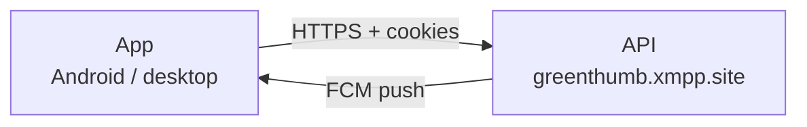

<div align="center">


# GreenThumb

**Plant care: watering reminders, photos, offline-first.**

[](kmp/README.md)
[](kmp/README.md)
[](kmp/README.md)
[](https://github.com/vivogf/greenthumb-mobile/actions/workflows/check.yml)
[](kmp/docs/release-gate-rollout.md)

</div>

## Screenshots

<table>
  <tr>
    <td align="center"><br><sub>Plant list</sub></td>
    <td align="center"><br><sub>Plant card</sub></td>
    <td align="center"><br><sub>Add plant</sub></td>
    <td align="center"><br><sub>Settings</sub></td>
    <td align="center"><br><sub>Russian localization</sub></td>
  </tr>
</table>

## Features

- **Care reminders** — watering, fertilizing, repotting, pruning: every plant
  has its own frequency and "last done" date.
- **Plant photos** — from the camera or the gallery, resized before upload.
- **Offline-first** — the app runs on a local database without a network;
  changes are queued and delivered when the connection is back.
- **Push reminders** — at the chosen hour; a tap opens the plant card.
- **Russian and English** languages, light and dark themes.
- **Anonymous login with a recovery key** — no email or password; the key is
  generated on the device and kept only by you.
- **Account deletion right in the app** — with a full local cleanup.

## How it works

- **Kotlin Multiplatform** — shared code (network, storage, business logic, UI
  with Compose Multiplatform) in `kmp/shared`.
- **Android** — the release app (`kmp/androidApp`, package
  `com.greenthumbplantcare`).
- **JVM desktop** — a dev harness with hot reload for UI development
  (`kmp/desktopApp`), not for release.
- **Backend** — a separate repository, [vivogf/GreenThumb](https://github.com/vivogf/GreenThumb)
  (Express + Drizzle + Neon PostgreSQL), API: `https://greenthumb.xmpp.site`.



## Quick start

Build, run, tests and the project layout — in [kmp/README.md](kmp/README.md).
In short:

```bash
cd kmp
export JAVA_HOME=/opt/homebrew/opt/openjdk@21/libexec/openjdk.jdk/Contents/Home
./gradlew :androidApp:assembleDebug    # debug APK
bash scripts/check.sh                  # full gate: compilation, tests, grep rules
```

## Documentation

- [kmp/README.md](kmp/README.md) — build, run, tests, project layout.
- [kmp/docs/release-gate-rollout.md](kmp/docs/release-gate-rollout.md) — rollout
  gate and staged rollout.
- [kmp/docs/crash-baseline.md](kmp/docs/crash-baseline.md) — crash baseline and
  rollout halt thresholds.
- [kmp/docs/incident-runbook.md](kmp/docs/incident-runbook.md) — what to do in
  an incident.
- Public pages (GitHub Pages): [Privacy Policy](https://vivogf.github.io/greenthumb-mobile/privacy.html)
  and [Account Deletion](https://vivogf.github.io/greenthumb-mobile/account-deletion.html) —
  sources in [docs/](docs/).

## Status

- **`kmp/`** — the active app (Kotlin Multiplatform + Compose Multiplatform),
  being prepared for release; all new development happens here.
- **Repository root** — the legacy Expo app (Expo SDK 55 / React Native). It is
  **no longer shipped** and is kept for history and as the source of the
  recovery-key handoff migration (`gt-handoff.json`). Not developed further.

## Privacy

No analytics and no trackers. Anonymous accounts without an email. Crash
reports go through Firebase Crashlytics (crash logs, no personal data). Details
on the [privacy page](https://vivogf.github.io/greenthumb-mobile/privacy.html).
